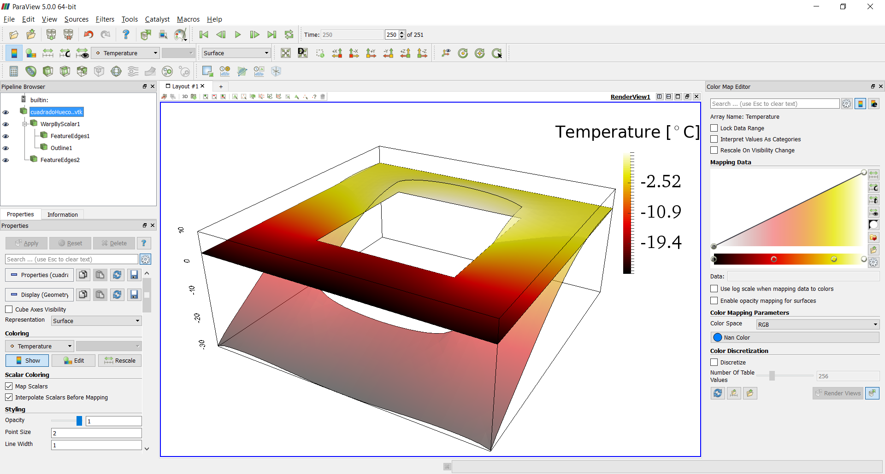
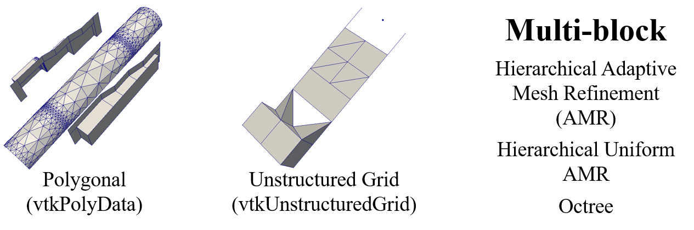

% Paraview Tutorial
% Nicolas Guarin-Zapata
% October 26, 2016

------------------

## What is Paraview?
- Description
- Example

------------------

## Tutorial Data

You can clone the repo using:

    git clone https://github.com/nicoguaro/paraview_workshop.git

Or download as a zip in

  - [https://github.com/nicoguaro/paraview_workshop/archive/master.zip](https://github.com/nicoguaro/paraview_workshop/archive/master.zip)

------------------

## Basics of Visualization

------------------

## Data Types

------------------

## Paraview Graphic Interface

------------------

## References

- [The Paraview Tutorial](http://www.paraview.org/Wiki/The_ParaView_Tutorial)
- [The Visualization Toolkit]()