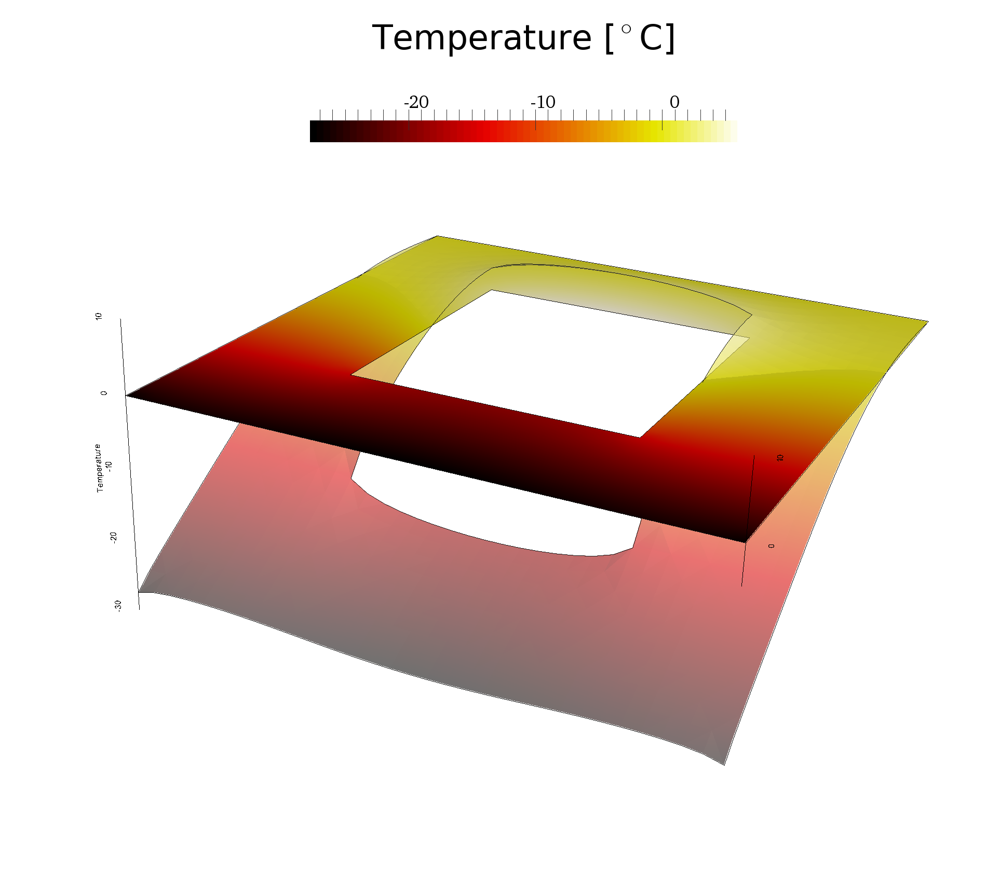

% Paraview Tutorial
% Nicolas Guarin-Zapata  @nicoguaro, nguarin@purdue.edu
% October 26, 2016

------------------

# What is Paraview?

From Wikipedia:

>> ParaView is an open source multiple-platform application for interactive, scientific visualization. It has a client–server architecture to facilitate remote visualization of datasets, and generates level of detail (LOD) models to maintain interactive frame rates for large datasets. It is an application built on top of the Visualization Toolkit (VTK) libraries.

------------------

# Examples

    
------------------

# Installation

You can download the most recent version of Paraview in the Official website and just run the installer in your machine:

- [http://www.paraview.org/download/](http://www.paraview.org/download/)

------------------

# Tutorial Data

You can clone the repo using:

    git clone https://github.com/nicoguaro/paraview_workshop.git

Or download as a zip in

- [https://github.com/nicoguaro/paraview_workshop/archive/master.zip](https://github.com/nicoguaro/paraview_workshop/archive/master.zip)

------------------

# Why visualize?

<object width="1400" height="600" data="The_Scream_table.html"></object>

------------------

# Data Types

------------------

# Paraview Graphic Interface

------------------

# Representations

------------------

# Common filters

    
------------------

# References

- [The Paraview Tutorial](http://www.paraview.org/Wiki/The_ParaView_Tutorial)
- [The Visualization Toolkit]()